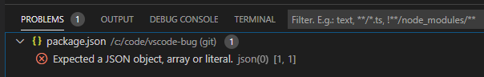
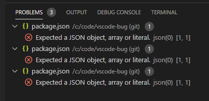

# vscode-bug

A demo repository to show a language-detection bug in vs-code.

## Table of contents

  * [Add description for the vscode bug](#add-description-for-the-bug)
  * [Add picture to show the problem has trippled](add-picture-to-show-the-problem-trippled)

## Add description for the vscode bug

For some reason vscode claims that a non-existing `package.json` in the repository  
is meant to be JSON, allthough it's this readme which is written in Markdown (.md).

The language-mode auto-detection seems not to work properly before this commit.

This picture shows the problem:

The version of vscode used:

    Version: 1.41.1 (system setup)
    Commit: 26076a4de974ead31f97692a0d32f90d735645c0
    Date: 2019-12-18T14:58:56.166Z
    Electron: 6.1.5
    Chrome: 76.0.3809.146
    Node.js: 12.4.0
    V8: 7.6.303.31-electron.0
    OS: Windows_NT x64 10.0.18363

## Add picture to show the problem has trippled

The further you continue to commit - the more often the error seems to appear:

